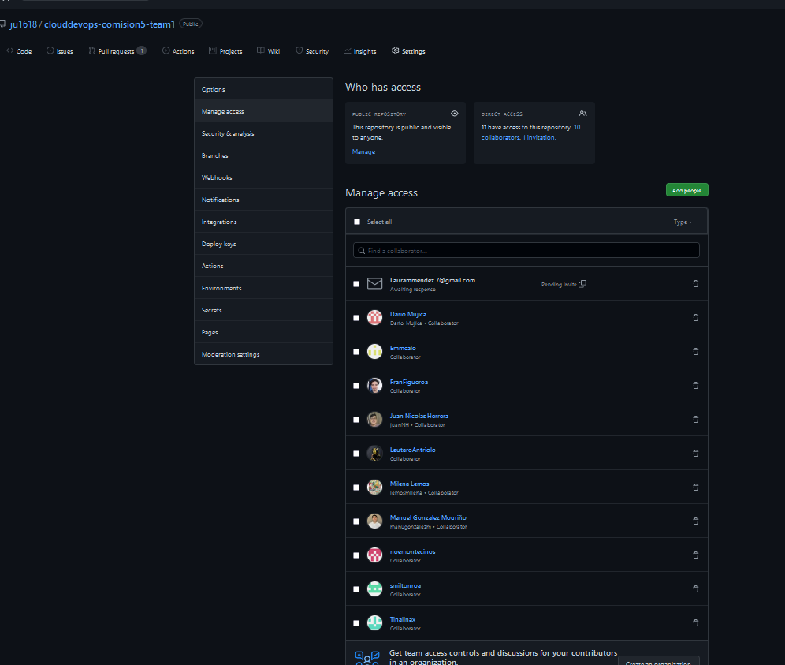

>	Creación de Paneles en Trello integrado con Jira y Attlasian

>	 El PO se encargara de determinar las tareas del DevTeam, pero en conjunto con ellos, no se las impone, sino que se dialogan

>   Cada uno de los miembros del equipo deberán:
>   Formar parte de un repositorio en Github, en este repositorio, el PO se encargara de crearlo e invitar a los miembros del equipo de Desarrollo y al Scrum master.

>   Una vez que todos formen parte del proyecto en Github, es necesario que el PO cree dentro del repositorio un archivo readme.md especificando los miembros del proyecto, nombre completo y correos electrónicos, sitios de linkedin, rol laboral y carrera que cursan en EducacionIT

>   Cuando todos estos pasos se encuentren listos, es necesario reportar la finalización de la tarea 1 en Trello, el profesor analizara si se ha realizado correctamente
