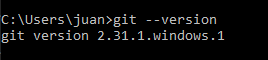
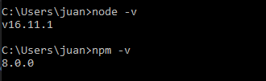

# Tarea 2

>	Una vez creado el repositorio grupal y que estén invitados todos los miembros, será necesario que cada uno de los miembros instale.

>	Git, en su ultima versión,y creen un directorio para el repositorio de Github para luego sincronizarlo.

Pasos
----------------------------------------------------------------

* Ingresar a https://git-scm.com/downloads y descargar la versión que corresponda a su SO 
    * Tip: Ingresar a la consola(CMD) y escribir **git --version**
* Ingresar a la URL del repo: https://github.com/ju1618/clouddevops-comision5-team1 y clonarlo mediante el medio que mas le guste( consola, gitHubDesktop, gitKraken, etc). 

>	Visual Studio en su ultima versión , luego, instalen el Plugin de Terraform, el Plugin de HTML Marks, y el Plugin de autocompletado, así como los Plugins de Javascript, de Node y React. (Los mismos se verán en clase).

Pasos
----------------------------------------------------------------
* Ingresar a https://code.visualstudio.com y desgargar la versión que corresponda a su SO

>	también es necesario sincronizar Visual Studio Code con la cuenta de Github, en este caso, será necesario que la sincronizen y que cada miembro cargue que ha podido sincronizar su Visual Studio con el repositorio de Github del proyecto.

Pasos
----------------------------------------------------------------
* Abrir Visual Studio Code. Si ya tienen clonado el repositorio en una carpeta local solo necesitan ir a "File" -> "Open Folder" e ir hasta la carpeta donde se encuentra el repositorio. 

* Si todavia no clonaron el repositorio, se puede hacer por VSC. Vamos a "View" -> "Command Palette" y escribir "Git Clone", lo seleccionamos y nos pide el url del repositorio en github, copiamos de github el url y volvemos a VSC para pegarlo, luego guardamos el repositorio en una carpeta local nuestra. Finalmente aparece una notificacion diciendo si queremos abrir el repositorio clonado y le damos que si.

* Una vez abierto la carpeta del repositorio, se puede modificar cualquier archivo como prueba. 

* Luego vamos a "Terminal" -> "New Terminal" y escribir "git init", despues para actualizar el cambio que hicimos usamos los siguiente comandos
git add <nombrearchivo>
git commit -m "comentario"
git push

Y asi el archivo estaria actualizado

Pasos
----------------------------------------------------------------
* Ingresar a https://nodejs.org/es/download/ y descargar la versión LTS que corresponda a su SO.
    * Tip: Ingresar a la consola(CMD) y escribir **node -v**  . Como agregado adicional se tiene el gestor de paquetes npm, escribir **npm -v** para corroborar la versión. 
        

>	Luego será necesario que instalen el modulo de ReactJS y de Express (Se vera en clase como realizarlo).

>	Si ustedes conocen el procedimiento también pueden realizarlo y así agilizar la entrega.

>	Para comprobar que la tarea 2 y cada uno de sus puntos fue realizado correctamente, es necesario que actualicen diariamente en el repositorio de github un archivo de texto con el progreso de cada tarea y minutas de las reuniones de equipo.

>	Una vez resuelto este aspecto, será necesario actualizar también los estados de las tareas en trello, el objetivo será.

>	Actualizar todo el progreso de manera proactiva en los tableros de Trello y en el Proyecto de Github.
