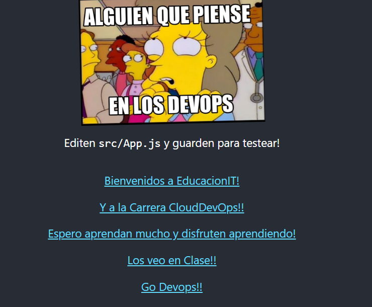
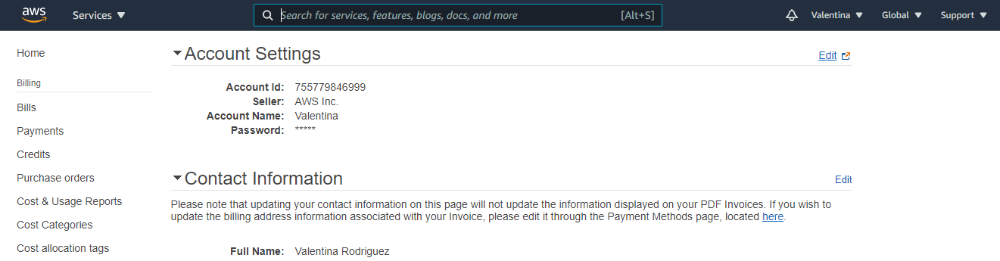
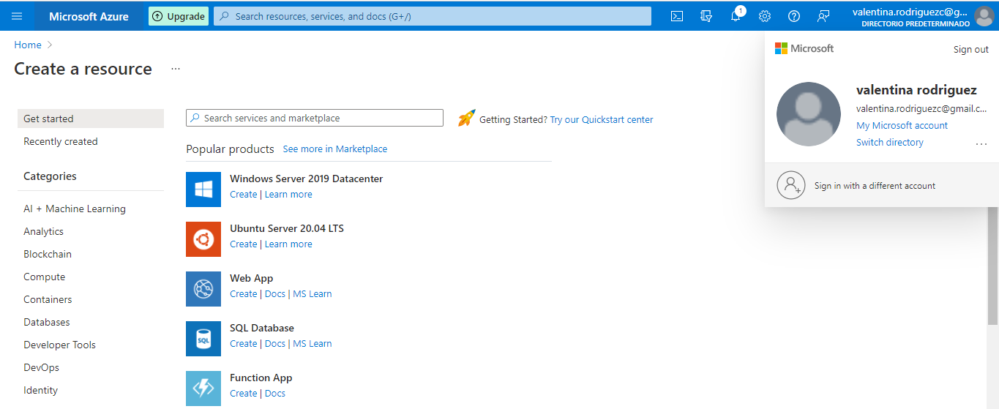
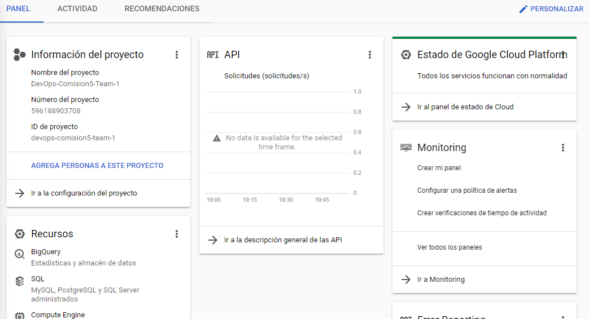

# Tarea 3

>	En esta instancia del proyecto, se les proveerá una aplicación web simple para que la utilizemos como proyecto de deployment a lo largo de las clases, sin embargo, la utilizaremos en breve.

>	Las actividades de la tarea 3 son:

*	El PO deberá crear una cuenta gratuita en Amazon Web Services, Google Cloud Platform y Microsoft Azure. Si no dispone de los recursos para crear la misma otro miembro del equipo puede asistir en este proceso

*	Una vez que se haya creado cada una de las cuentas, recuerden actualizar la tarea con capturas del nombre de usuario y la cuenta en Trello

*	Una vez que se hayan creado las cuentas en cada uno de los proveedores, será necesario crear, en cada una de las cuentas de AWS,Azure y GCP

>	1 instancia con Windows Server 2019 en Amazon Web Services, con RDP, un Security group abierto a internet, en la zona de disponibilidad A de South America, el nombre debe ser “InstanciaCloudDevopsTeam” y el nombre del team , esta instancia debe estar creada con los tags (año,sistema operativo, nombre del equipo, carrera, educacionit como institución, proyecto (carrera clouddevops) , también el tag de “Entorno “ con el valor “Development”, debe tener un disco EBS de 30 gb,  para confirmar que esta instancia fue creada, debe actualizar con capturas de la misma y de la dirección IP en trello 

>	1 instancia con Windows Server2012  en Amazon Web Services, con RDP, un Security group abierto a internet, en la zona de disponibilidad B de South America, el nombre debe ser “InstanciaCloudDevopsTeam” y el nombre del team  , esta instancia debe estar creada con los tags (año,sistema operativo, nombre del equipo, carrera, educacionit como institución, proyecto (carrera clouddevops) , también el tag de “Entorno “ con el valor “Stage”, debe tener un disco EBS de 30 gb,  para confirmar que esta instancia fue creada, debe actualizar con capturas de la misma y de la dirección IP en trello

>	1 instancia con Windows Server 2016 en Amazon Web Services con EC2,del tipo t2.micro, el único disponible en la capa gratuita,  con acceso RDP, un Security group abierto a internet, en la zona de disponibilidad C de South America, . el nombre debe ser “InstanciaCloudDevopsTeam” y el nombre del team , esta instancia debe estar creada con los tags (año,sistema operativo, nombre del equipo, carrera, educacionit como institución, proyecto (carrera clouddevops) , también el tag de “Entorno “ con el valor “Produccion”, debe tener un disco EBS de 30 gb,  para confirmar que esta instancia fue creada, debe actualizar con capturas de la misma y de la dirección IP en trello 
	 

>	Por ultimo, será necesario que el DevTeam cree una AMI, Amazon Machine Image de la instancia de Windows Server 2019, y cambien el fondo de pantalla a un fondo que demuestre que el equipo lo creo, pueden utilizar logotipos o diseñar su propio wallpaper, una vez creada esta AMI, que debe tener instaladas las siguientes herramientas en Windows 2019 Server:

*	Docker en su ultima Version
*	WAMP
*	Kubernetes
*	Visual Studio
*	El ejecutable de Terraform
*	Jenkins en su ultima versión 
*	GIT

>  Esta AMI, será la prueba de que ustedes pueden crear un entorno de DevOps que luego podrán distribuir a otros miembros de su equipo para que creen instancias en base a esta AMI y así tener una infraestructura de desarrollo alineada.
Una vez realizadas todas estas tareas, y actualizado en Trello así como en el repositorio de Github, podemos dar por concluida cada una de estas tareas.
